<h1 align="center">𝗟𝗔𝗦𝗧.𝗙𝗠 𝗦𝗖𝗥𝗢𝗕𝗕𝗟𝗘𝗥</h1>

<p align="center">
  
  
  
</p>


<p align="center">
  A responsive terminal application for searching, curating, previewing, and
  scrobbling Last.fm album queues.
</p>

### Install

**macOS with Homebrew**

```bash
brew install deathrashed/tap/scrobbler
```

**Other platforms**

Download a prebuilt binary for macOS, Linux, or Windows from
[GitHub Releases](https://github.com/deathrashed/lastfm-scrobbler/releases/latest).

<p align="center">
  <a href="#features">Features</a> •
  <a href="#installation--build">Installation</a> •
  <a href="#quick-start">Quick start</a> •
  <a href="#documentation">Documentation</a> •
  <a href="#screenshots">Screenshots</a> •
  <a href="#headless-cli">CLI</a> •
  <a href="#credentials">Configuration</a> •
  <a href="#troubleshooting">Troubleshooting</a>
</p>

The visual system is deliberately consistent across every screen:

- responsive terminal layout that live-resizes from 67 to 127 columns, then remains centered on wider terminals
- bounded responsive working panels that expand where useful without stretching natural-size controls
- warm-white structural borders and higher-contrast muted text
- Last.fm red active controls
- height-aware hero / classic / compact header density
- centered panels and footer hints that collapse on short terminals
- wrapped or clipped long text that cannot break a border
- Nerd Font icons with plain-text fallbacks where practical

The TUI requires at least 67 terminal columns. Header density adapts to
terminal height: tall windows use the new framed Last.fm hero header, medium
windows retain the classic header, and short windows automatically use the
compact four-line header. **Compact Header** remains available as a force-compact
preference. Manual and Discography add artist context after resolution. Hero
and classic profile URLs highlight on hover and open on click; compact mode has
no profile URL. In the hero layout the user URL is embedded in the top frame
and current/recent activity becomes the lower frame caption, keeping live
account and playback context attached to the brand instead of spending a
separate metadata row. Optional Now Playing remains display-only and never
submits playback state.

<details>
<summary><strong>Responsive terminal layout</strong></summary>

The TUI has a 67-column minimum and live-resizes up to a 127-column outer
layout. On wider terminals the application remains centered.

Working surfaces expand selectively:

- result and track lists show more text
- filters and paths gain useful width
- taller terminals show additional result rows
- cards and compact controls retain natural proportions
- mouse hitboxes follow the live geometry

</details>

##  Features

| Area | What it provides |
| --- | --- |
| **Manual scrobbling** | Search by artist, album, or both, choose tracks, preview the queue, and scrobble with configurable loops and intervals. |
| **Discography curation** | Filter, sort, clean, select, and queue albums returned by Last.fm's top-albums endpoint. |
| **Import workflows** | Load TXT, CSV, TSV, JSON, M3U/M3U8 playlists, album folders, or artist folders. |
| **Recovery** | Keep history, resume interrupted queues, edit saved sessions, or perform exact re-runs. |
| **Automation** | Use stable JSON-capable CLI commands from Keyboard Maestro, shell scripts, and launch agents. |
| **Terminal UI** | A responsive Bubble Tea interface that live-resizes from 67–127 columns, centers itself on wider terminals, adapts list/panel widths and heights, and supports mouse input. |

##  Installation & Build

Choose the distribution that fits your platform. Release binaries and the
Homebrew package do not require Go; Go 1.24.2 or newer is only required for
`go install` and source builds.

| Method | Platforms | What it provides |
| --- | --- | --- |
| [Homebrew](#homebrew-macos) | macOS Apple Silicon and Intel | Managed binary plus Zsh, Bash, and Fish completions |
| [GitHub Releases](#github-release-binaries) | macOS Apple Silicon/Intel, Linux x86_64/ARM64, Windows x64 | Prebuilt archives, `LICENSE`, and four generated completions |
| [Go install](#go-install-and-source-build) | macOS, Linux, Windows | A source/module install using the current tagged module |
| [Source build](#go-install-and-source-build) | macOS, Linux, Windows | A checkout build for development or maintainers |

### Homebrew (macOS)

```bash
brew install deathrashed/tap/scrobbler
scrobbler --version
```

The formula installs the `scrobbler` binary and Zsh, Bash, and Fish
completions. PowerShell completion remains available through the binary's
completion generator or the TUI completion installer.

### GitHub release binaries

Download [Last.fm Scrobbler v1.2.0](https://github.com/deathrashed/lastfm-scrobbler/releases/tag/v1.2.0),
verify the matching entry in `checksums.txt`, and put the executable on your
PATH:

| Platform | Archive |
| --- | --- |
| macOS Apple Silicon | `scrobbler-v1.2.0-darwin-arm64.tar.gz` |
| macOS Intel | `scrobbler-v1.2.0-darwin-amd64.tar.gz` |
| Linux x86_64 | `scrobbler-v1.2.0-linux-amd64.tar.gz` |
| Linux ARM64 | `scrobbler-v1.2.0-linux-arm64.tar.gz` |
| Windows x64 | `scrobbler-v1.2.0-windows-amd64.zip` |

Unix archives contain `scrobbler`, `LICENSE`, and all four completion files.
The Windows archive contains `scrobbler.exe`, `LICENSE`, and the same
completion files. No package manager or Go installation is required.

### Go install and source build

Go 1.24.2 or newer is required for these paths. `go install` is a module/source
installation, not a prebuilt release archive:

```bash
go install github.com/deathrashed/lastfm-scrobbler/cmd/scrobbler@latest
```

To build a checkout:

```bash
git clone https://github.com/deathrashed/lastfm-scrobbler.git
cd lastfm-scrobbler
mkdir -p bin
go build -buildvcs=false -o bin/scrobbler ./cmd/scrobbler
```

For a build with explicit version metadata, keep the values variable so the
command remains correct after the next release:

```bash
VERSION=${VERSION:-development}
COMMIT=$(git rev-parse --verify HEAD)
go build -buildvcs=false \
  -ldflags "-X github.com/deathrashed/lastfm-scrobbler/internal/version.Version=$VERSION \
            -X github.com/deathrashed/lastfm-scrobbler/internal/version.Commit=$COMMIT \
            -X github.com/deathrashed/lastfm-scrobbler/internal/version.Repository=deathrashed/lastfm-scrobbler" \
  -o bin/scrobbler ./cmd/scrobbler
```

A Nerd Font is recommended for the intended icons. Internet access is needed
for the first source build so Go can download modules.

### First-run setup

After installing a release binary, Homebrew package, or source build, launch:

```bash
scrobbler
```

When no usable configuration exists, the cross-platform first-run wizard
opens before the Dashboard. It collects Last.fm credentials, lets you choose
the credential source, stages scrobbling and interface defaults, optionally
installs a user-scope Nerd Font, and applies changes only after **Review →
Apply**. Canceling earlier leaves credentials, font files, and terminal
configuration untouched. Run `scrobbler setup` later to review it again.

The wizard works on macOS, Linux, and Windows without requiring Homebrew,
Chocolatey, Scoop, apt, dnf, or another package manager. It supports macOS
Keychain where available and otherwise offers owner-only credentials-file or
environment-variable backends. Automatic terminal font configuration is
limited to detected Ghostty configurations; other terminals receive manual
instructions while font installation can still complete.

##  Quick Start

1. Install `scrobbler` with [Homebrew](#homebrew-macos), a [release
   archive](#github-release-binaries), or [Go/source](#go-install-and-source-build).

2. Launch it:

```bash
scrobbler
```

3. Complete the first-run wizard. Enter your Last.fm credentials, choose the
   credential source, review the proposed settings, and select **Apply**.

4. Verify the connection without submitting a scrobble:

   ```bash
   scrobbler test --json
   ```

For a source-tree build, the manual `.env` path remains available as an
advanced alternative:

```bash
cp .env.example .env
chmod 600 .env
go build -buildvcs=false -o bin/scrobbler ./cmd/scrobbler
./bin/scrobbler
```

See [Credentials](#credentials) for the exact source-tree, installed-binary,
environment, remembered-path, and Keychain resolution rules.

> [!TIP]
> Use `scrobbler test --json` after setup. It checks Last.fm access and
> authentication readiness without submitting a scrobble.

> [!WARNING]
> Keep `.env`, `~/.env`, and exported credentials files private. Use the
> redacted diagnostics bundle when sharing troubleshooting information.

## Documentation

The README gives the short path from installation to a working scrobble. The
full guides cover the details without making the main page a wall of text:

| Guide | Covers |
| --- | --- |
| [Installation](docs/INSTALLATION.md) | Release binaries, Homebrew, Go installs, and source builds |
| [Setup wizard](docs/SETUP.md) | Review/Apply flow, platform detection, fonts, and credential choices |
| [TUI controls and workflows](docs/TUI.md) | Screens, navigation, responsive layout, mouse behavior, and recovery |
| [CLI reference](docs/CLI.md) | Commands, flags, JSON output, and automation-safe behavior |
| [Configuration and credentials](docs/CONFIGURATION.md) | Environment files, profiles, Keychain, defaults, and precedence |
| [Shell completions](docs/COMPLETIONS.md) | Zsh, Bash, Fish, PowerShell, generation, and installation |
| [File imports](docs/FILE-IMPORTS.md) | TXT, CSV, TSV, JSON, M3U/M3U8, album folders, and artist folders |
| [Platform support](docs/PLATFORMS.md) | macOS, Linux, Windows, pickers, fonts, and credential backends |
| [Automation and Keyboard Maestro](docs/AUTOMATION.md) | JSON workflows, launch agents, and automation integration |
| [Updates](docs/UPDATES.md) | Official GitHub Releases checks and custom update sources |
| [Troubleshooting](docs/TROUBLESHOOTING.md) | Configuration, connectivity, terminal, and diagnostics problems |
| [v1.2.0 release notes](docs/RELEASE_NOTES_v1.2.0.md) | User-facing changes and supported release assets |
| [Release checklist](docs/RELEASING.md) | Maintainer validation, packaging, checksums, and publishing |

##  Screenshots

The interface keeps the same Torch Red, cell-aligned visual language across
search, selection, settings, recovery, and scrobbling workflows. The gallery
uses the current captures and follows the recommended walkthrough order.
The Dashboard footer is:

```text
enter select • → ↑ navigate ↓ ← • s settings
i info • h history • m d quick f q • r rerun • ? help
```

Here `F` opens File, `Q` quits, and `M`/`D` are the two quick actions. Profiles
remain under Settings rather than on the Dashboard. The Info screen groups
reference material into Modes, Automation, Data, Curation, and Imports.
Settings is organized into Account, Scrobbling, History, Tools, Interface, and
Profiles.

<table>
  <tr>
    <td width="33%" valign="top">
      <a href="assets/screenshots/1-dashboard.png"></a>
      <p align="center"><strong>Dashboard</strong><br><sub>Choose Manual, Discography, or File; use the current footer shortcuts</sub></p>
    </td>
    <td width="33%" valign="top">
      <a href="assets/screenshots/2-info.png">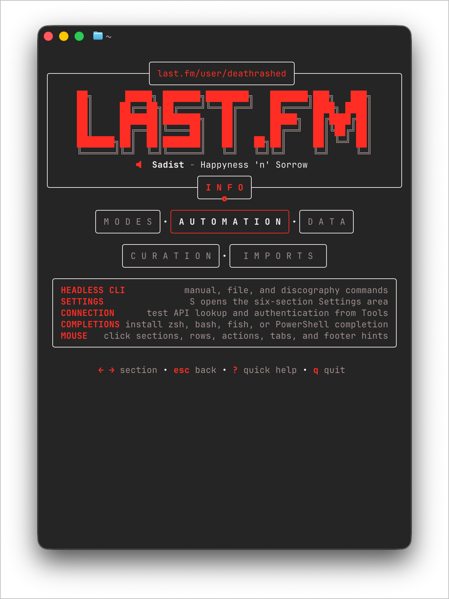</a>
      <p align="center"><strong>Info</strong><br><sub>Modes, Automation, Data, Curation, and Imports reference</sub></p>
    </td>
    <td width="33%" valign="top">
      <a href="assets/screenshots/3-help.png">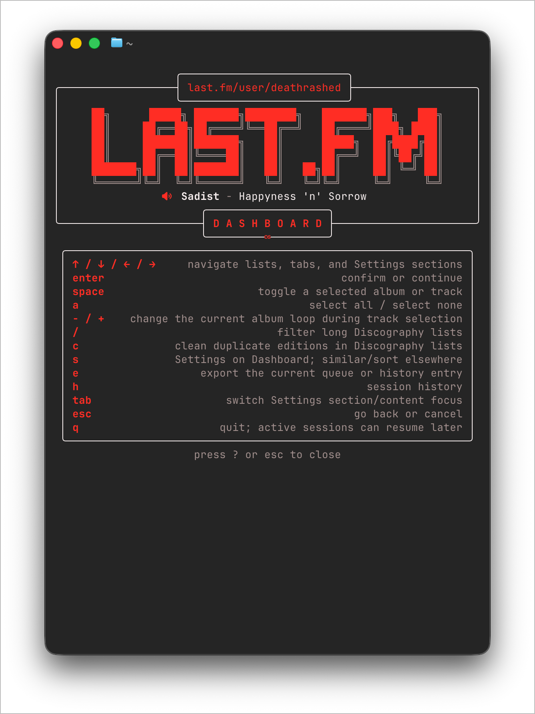</a>
      <p align="center"><strong>Help</strong><br><sub>Keyboard and mouse controls with clickable close</sub></p>
    </td>
  </tr>
  <tr>
    <td valign="top">
      <a href="assets/screenshots/4-history.png">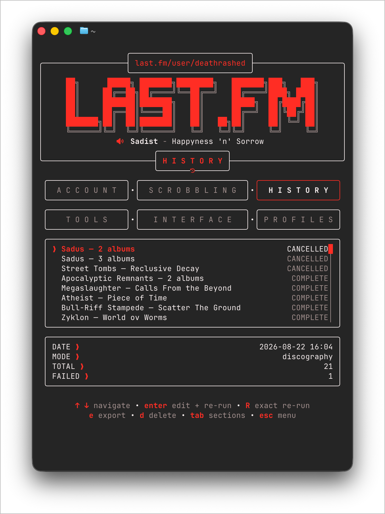</a>
      <p align="center"><strong>History</strong><br><sub>Review, export, delete, or rerun sessions</sub></p>
    </td>
    <td valign="top">
      <a href="assets/screenshots/5-manual-search.png">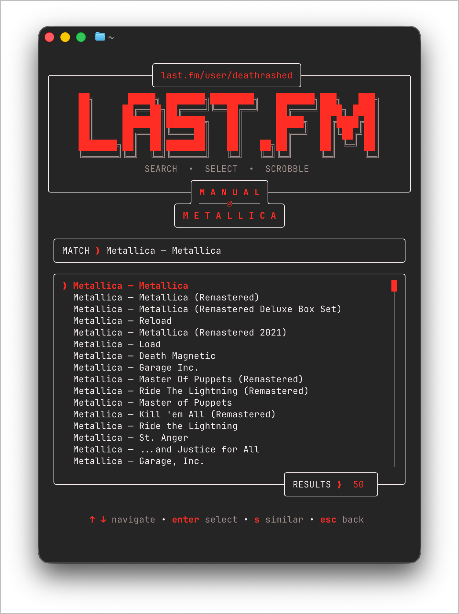</a>
      <p align="center"><strong>Manual search</strong><br><sub>Search by artist, album, or both</sub></p>
    </td>
    <td valign="top">
      <a href="assets/screenshots/6-manual-queue.png">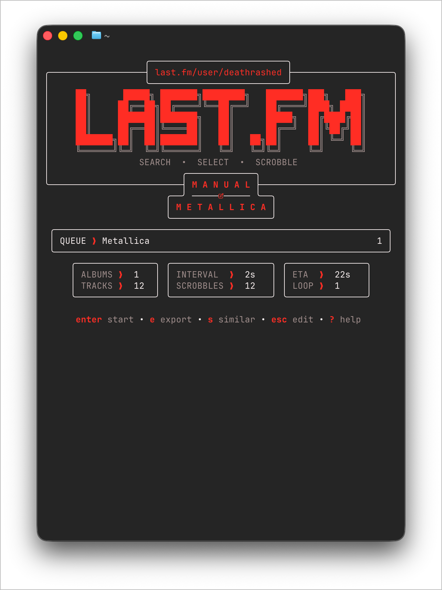</a>
      <p align="center"><strong>Manual queue</strong><br><sub>Review tracks, interval, loops, and ETA</sub></p>
    </td>
  </tr>
  <tr>
    <td valign="top">
      <a href="assets/screenshots/7-discography-select.png">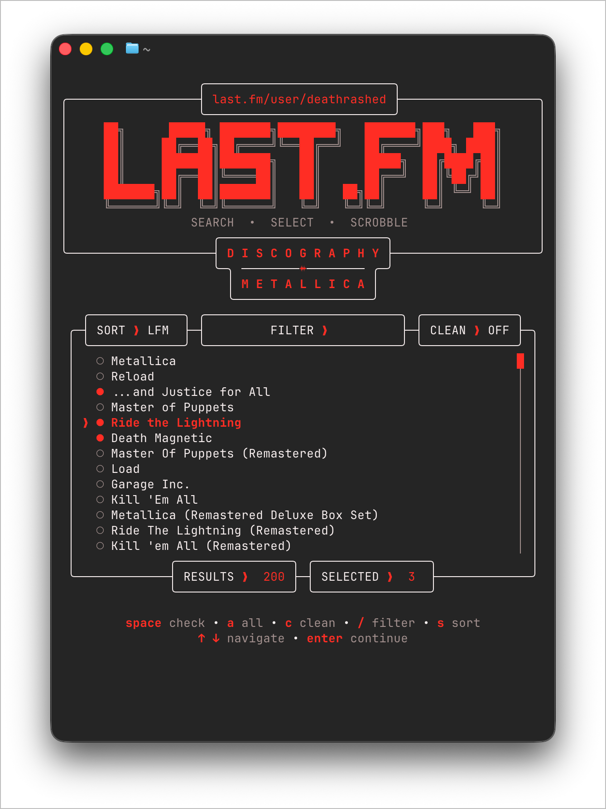</a>
      <p align="center"><strong>Discography selection</strong><br><sub>Select returned albums before loading tracks</sub></p>
    </td>
    <td valign="top">
      <a href="assets/screenshots/8-discography-filter.png"></a>
      <p align="center"><strong>Discography filter</strong><br><sub>Use the connected FILTER input with RESULTS and SELECTED counters</sub></p>
    </td>
    <td valign="top">
      <a href="assets/screenshots/9-discography-run.png">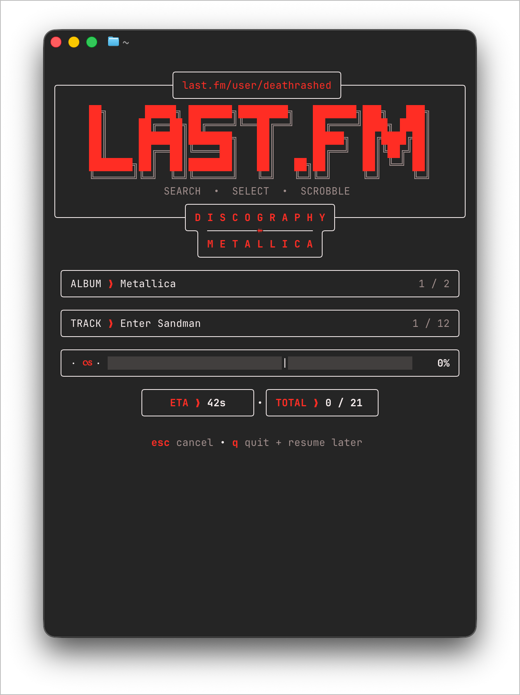</a>
      <p align="center"><strong>Discography progress</strong><br><sub>Track multi-album scrobble progress</sub></p>
    </td>
  </tr>
  <tr>
    <td valign="top">
      <a href="assets/screenshots/10-discography-complete.png">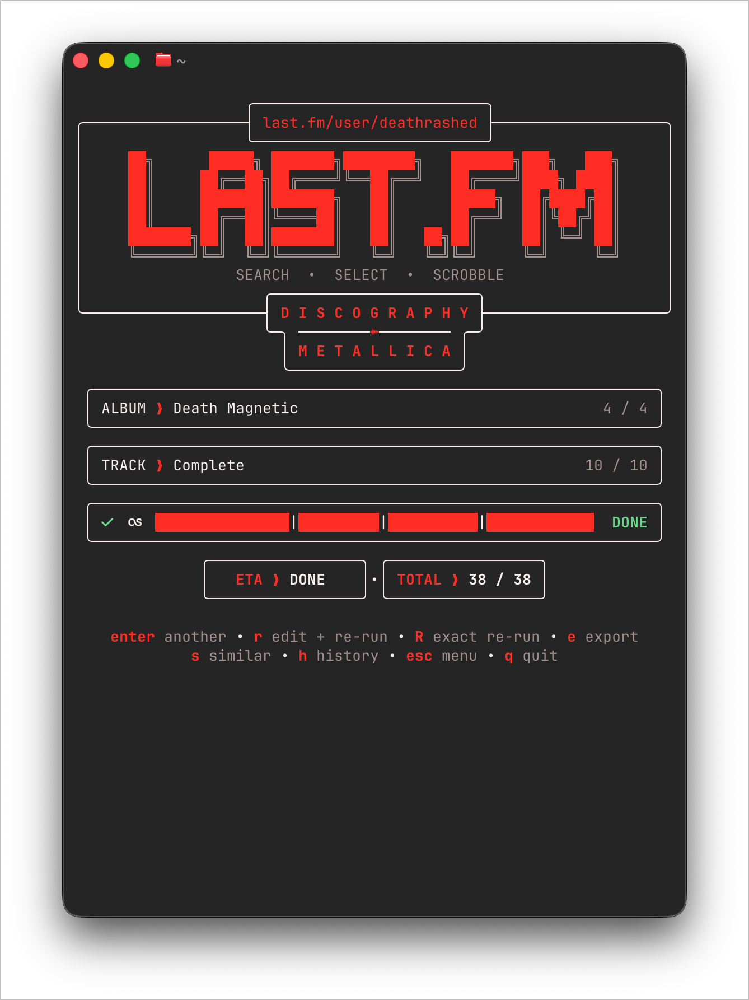</a>
      <p align="center"><strong>Discography complete</strong><br><sub>Confirm completion and rerun or export</sub></p>
    </td>
    <td valign="top">
      <a href="assets/screenshots/11-settings.png">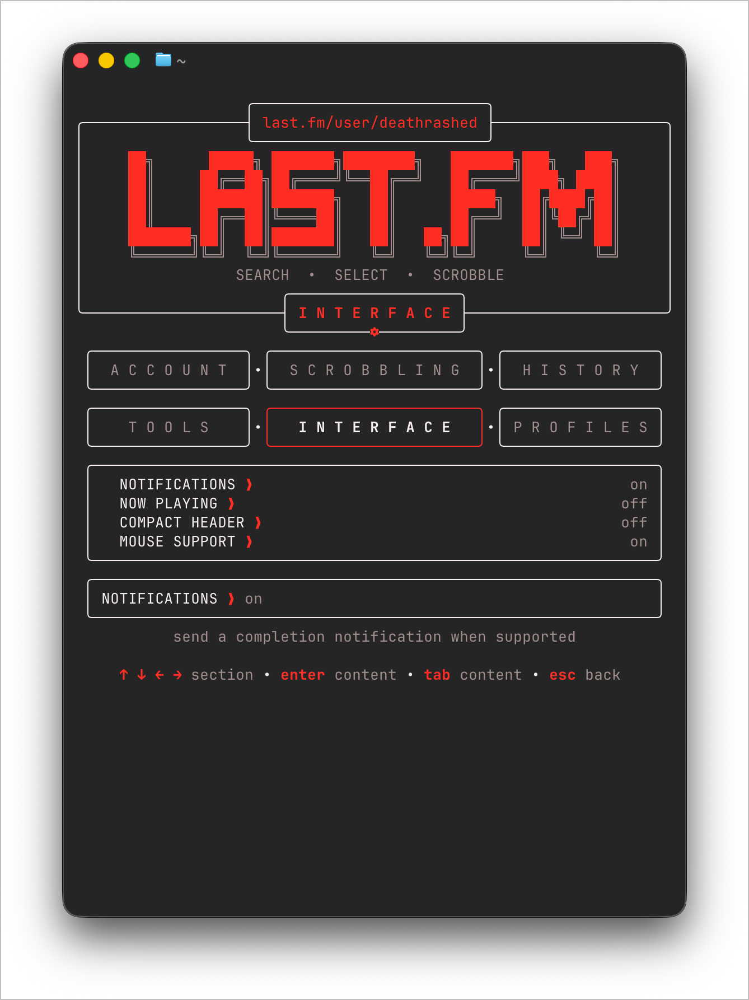</a>
      <p align="center"><strong>Settings</strong><br><sub>Account, Scrobbling, History, Tools, Interface, and Profiles</sub></p>
    </td>
    <td valign="top">
      <a href="assets/screenshots/12-settings-nowplaying-header.png">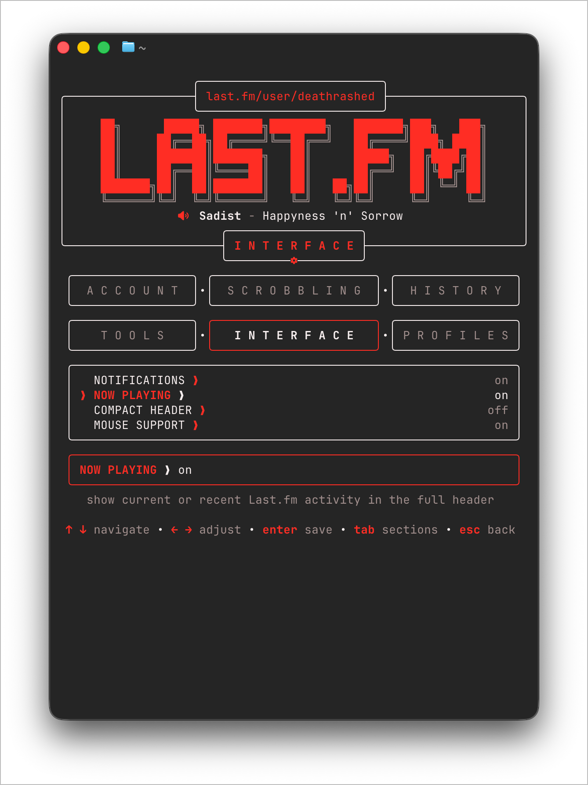</a>
      <p align="center"><strong>Now Playing on</strong><br><sub>Enable current or recent Last.fm activity in the full header</sub></p>
    </td>
  </tr>
  <tr>
    <td valign="top">
      <a href="assets/screenshots/13-settings-compact-header.png">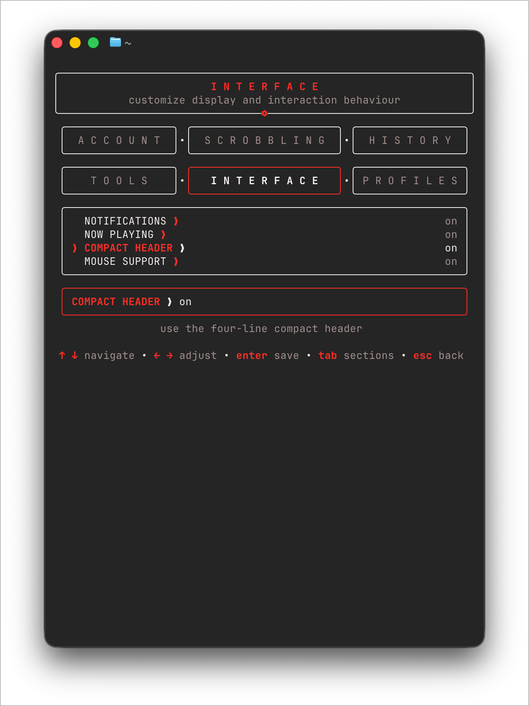</a>
      <p align="center"><strong>Compact Header on</strong><br><sub>Interface setting for the four-line header</sub></p>
    </td>
    <td valign="top">
      <a href="assets/screenshots/14-file.png">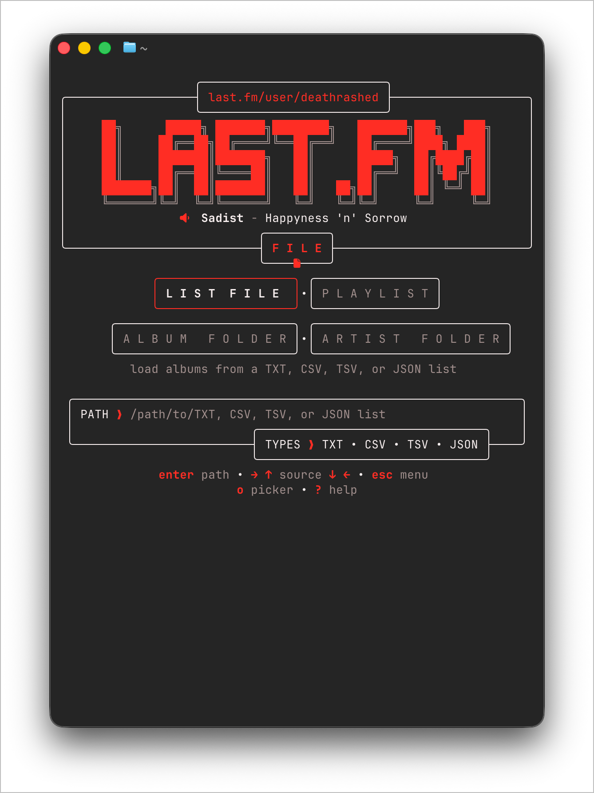</a>
      <p align="center"><strong>File workflow</strong><br><sub>Choose LIST FILE, PLAYLIST, ALBUM FOLDER, or ARTIST FOLDER and enter PATH</sub></p>
    </td>
    <td valign="top"></td>
  </tr>
</table>

##  Main TUI Workflows

### Manual

Search by artist, album, or both, select the correct result when necessary, choose
individual tracks, adjust loops and interval controls, inspect the dry-run
preview, and start scrobbling. Manual result lists show a compact attached
`RESULTS` count rather than a multiselect counter.

### Discography

Search an artist, filter and sort the returned albums, hide obvious reissues or
duplicates, select any combination, load their tracks, and build one queue. The
Discography chooser integrates `SORT`, `FILTER`, and `CLEAN` into the top border with
`RESULTS` and `SELECTED` attached below; long filters expand into a connected
wide input. The source is Last.fm's `artist.getTopAlbums` result, not a
canonical complete discography; long results and track lists include scroll
indicators.

### File and folder import

The File page keeps source selection and PATH entry on one screen. It supports:

- TXT, CSV, TSV, or JSON album lists
- M3U and M3U8 playlists
- one `Artist/Album` folder
- an artist folder containing album subfolders

Press `O` for the platform picker when available, or enter the path manually.
The screen shows the accepted formats in a dynamic `TYPE`/`TYPES` attachment.

### Similar albums

Press `S` from an album result, queue preview, or completed session to retrieve
album suggestions based on similar artists.

### History, recovery, and re-running

Completed and cancelled sessions are recorded locally. History can re-open a
saved queue for editing before it runs again. `Shift+R` performs an exact
re-run without editing. An interrupted active queue is offered for resume at
the next launch.

##  TUI Controls

| Context | Controls |
| --- | --- |
| **Global** | Arrow keys or `J/K` navigate, `Enter` confirms, `Esc` goes back, `Q` or `Ctrl+C` quits, and `?` opens help. |
| **Dashboard** | `M` Manual, `D` Discography, `F` File, `H` History, `S` Settings, `I` Info, `R` Last Session. Profiles remain under Settings. |
| **Track selection** | `Space` toggles a track, `A` selects all, `-/+` changes the current album loop, `Enter` continues, `S` finds similar albums; mouse footer controls also adjust interval and navigation directly. |
| **Settings** | `Tab` moves between section navigation and section content; arrows navigate the active zone; `Enter` saves, opens, or runs the selected item. |

When a text field is focused, printable characters are passed to the field so
usernames, passwords, API keys, paths, and filters can contain normal letters
without triggering navigation shortcuts.

##  Settings Interface

Press `S` from the Dashboard to open Settings. The six sections share one
symmetrical navigation grid that keeps natural card widths and spreads them as
the responsive application grows:

```text
╭─────────────────╮ ╭───────────────────────╮ ╭─────────────────╮
│  A C C O U N T  │•│  S C R O B B L I N G  │•│  H I S T O R Y  │
╰─────────────────╯ ╰───────────────────────╯ ╰─────────────────╯
╭─────────────────╮ ╭───────────────────────╮ ╭─────────────────╮
│    T O O L S    │•│   I N T E R F A C E   │•│ P R O F I L E S │
╰─────────────────╯ ╰───────────────────────╯ ╰─────────────────╯
```

The sections are grouped by purpose:

- **Account** — Last.fm username/password, API key/secret, credential source,
  credential path, authentication status, and reauthentication.
- **Scrobbling** — loop, interval, retries, duplicate guard, and Discography
  cleanup.
- **History** — saved sessions, edit/exact re-runs, export, and delete.
- **Tools** — export directory, GitHub Releases/custom update source, connection
  test, diagnostics, shell completions, and update checking.
- **Interface** — notifications, Now Playing, Compact Header, and Mouse Support.
- **Profiles** — load, create, save, and delete named profiles.

Settings has two keyboard focus zones. `Tab` or `Shift+Tab` moves from section
content to the six-section grid; arrow keys then choose a section, and `Enter`
or `Tab` returns to its content. Pressing `Up` from the first content row also
returns to the section grid. Mouse users can click a section or setting row
directly.

Settings rows deliberately use a quieter color hierarchy: idle labels are
white, the `❯` accent is Torch Red, and values are muted. The focused row uses
a leading `❯`, turns its label Torch Red, and turns the row arrow/value white;
mouse hover uses the same red-label emphasis without moving keyboard focus.

Navigation cards use a separate state language: idle labels are muted, hover
turns the label Torch Red, and the selected card uses a Torch Red border with
bold white text. Text inputs keep a white structural border and show focus with
a red label, white arrow, and blinking red cursor rather than a red input box.

The Connection Test validates the public API and checks authentication
readiness without sending a scrobble. Diagnostics creates a ZIP with runtime
details, redacted configuration, a history summary, and the tail of the
application log. Passwords, API secrets, session keys, and complete API keys
are excluded.

### Last.fm authentication

**Settings → Account** shows whether a session is stored (`✓ username` or
`✗ not authenticated`) without ever displaying the key itself, plus a
reauthentication action that starts the browser authorization flow.

When scrobbling fails with Last.fm error 9 (`Invalid session key`), the run
pauses instead of retrying: completed tracks are never resubmitted, the queue
is preserved, and the screen offers `a re-authenticate`. The auth screen
requests a fresh token, opens `https://www.last.fm/api/auth/`, and exchanges
the same token for a new session once you have granted permission — no restart
required, and returning resumes the interrupted run with its progress intact.
A failed exchange is summarized as `Error N · reason`; raw API messages stay
out of the main UI. See [docs/RELEASE_NOTES_v1.2.0.md](docs/RELEASE_NOTES_v1.2.0.md)
for the full walkthrough.

##  Credentials

Read-only Last.fm operations need an API key. Scrobbling needs an API key, API
secret, and authenticated session.

Either configure an existing session:

```env
API_KEY=...
API_SECRET=...
LASTFM_USERNAME=...
LASTFM_SESSION_KEY=...
```

or let the app obtain a mobile session:

```env
API_KEY=...
API_SECRET=...
LASTFM_USERNAME=...
LASTFM_PASSWORD=...
```

When `LASTFM_SESSION_KEY` is present, the password is not required for normal
scrobbling.

Credential sources:

- `auto`: process environment overrides file values; missing secrets may come
  from macOS Keychain
- `environment`: read credentials only from the real process environment
- `file`: read credentials from the selected environment file
- `keychain`: public values come from environment/file and secrets come from
  macOS Keychain

Saving an unrelated setting preserves file fallback values when an environment
or Keychain override is active. Newly acquired session keys go to Keychain for
`auto` and `keychain`, to the credentials file for `file`, and nowhere
automatically for `environment`.

### Environment file precedence

File selection and value precedence are separate. For automatic file
discovery, the application checks these locations in order:

1. `LASTFM_ENV_FILE`, when explicitly set.
2. The remembered path from **Settings → Account → Credential Path**, when it
   still exists.
3. The checkout-root `.env` when running the conventional source-tree binary
   at `<checkout>/bin/scrobbler`.
4. A `.env` in the current working directory, then the compatibility `go/`
   and parent-directory locations.
5. `~/.config/lastfm-scrobbler/.env` for an installed or release binary.

When automatic discovery is used, an existing `~/.env` fills only values
missing from the selected file. An explicit `LASTFM_ENV_FILE` or remembered
credentials path is loaded on its own. After file selection, real process
environment variables overlay file values in `auto` mode; `file` and
`environment` restrict credential reads as their names imply. `auto` fills
missing secret values from macOS Keychain when available, and built-in defaults
apply to non-secret settings.

`LASTFM_ENV_FILE=/absolute/path/to/file.env` forces a specific file. **Settings →
Account → Credential Path** can also change and remember the credentials path. `API_SECRET`,
`LASTFM_API_SECRET`, and `LASTFM_SHARED_SECRET` are accepted as aliases.

Credential files are written with owner-only permissions and are ignored by
Git. Never replace `.env.example` with real credentials or commit a credentials
file.

See [docs/CONFIGURATION.md](docs/CONFIGURATION.md) for every variable and its
precedence.

##  Headless CLI

Launching `scrobbler` without a command opens the TUI. Subcommands are stable,
non-interactive entry points suitable for Keyboard Maestro and shell scripts.

```bash
scrobbler manual "Slayer - Hell Awaits"
scrobbler manual --artist Slayer --album "Hell Awaits" --loop 2
scrobbler file ~/Downloads/albums.txt --dry-run
scrobbler discography "Demolition Hammer" --first 3 --dry-run
scrobbler discography "Demolition Hammer" --albums "Epidemic of Violence,Tortured Existence"
scrobbler similar "Demolition Hammer" --limit 20
scrobbler test --json
scrobbler diagnostics --json
scrobbler check-update
```

Common options for `manual`, `file`, and `discography`:

```text
--loop N
--limit N
--interval 2s
--dry-run
--json
```

The CLI returns exit code `0` for success, `1` for an operational failure, and
`2` for invalid command usage. JSON output is intended for automation systems
that need to inspect totals or exported paths.

Detailed command documentation and Keyboard Maestro examples are in
[docs/CLI.md](docs/CLI.md) and [docs/AUTOMATION.md](docs/AUTOMATION.md).

## Shell completion

Generate or install completion from the binary so it always matches the
installed commands. Installation is per-user and idempotent; it never requires
root or administrator access.

```bash
scrobbler completion install
scrobbler completion install zsh
scrobbler completion install bash
scrobbler completion install fish
scrobbler completion install powershell
```

### Zsh

```bash
mkdir -p ~/.zfunc
scrobbler completion zsh > ~/.zfunc/_scrobbler
fpath=(~/.zfunc $fpath)
autoload -Uz compinit && compinit
```

### Bash

```bash
scrobbler completion bash > ~/.scrobbler-completion.bash
source ~/.scrobbler-completion.bash
```

### Fish

```bash
mkdir -p ~/.config/fish/completions
scrobbler completion fish > ~/.config/fish/completions/scrobbler.fish
```

### PowerShell

```powershell
scrobbler completion powershell > $HOME/.config/powershell/completions/scrobbler.ps1
```

The TUI equivalent is **Settings → Tools → Install Completions**. A profile
reload may be needed after installation.

## Mouse support

Mouse support is enabled by default and can be disabled in **Settings → Interface** or with
`SCROBBLE_MOUSE=false`.

- click Dashboard modes, File import sources, Settings sections and rows
- use the mouse wheel to navigate results, Discography lists, tracks, Settings,
  History, and Profiles
- click Info tabs, action cards, editable fields, the Help close hint, and contextual footer actions
- hover feedback turns interactive card/list text Torch Red while preserving
  keyboard selection; full-header profile URLs are red at rest and white while
  hovered
- keyboard controls remain available everywhere

With the full header, the Last.fm URL is Torch Red at rest, turns white on
hover, and opens when clicked. Compact Header does not expose a URL target.

Bubble Tea mouse capture can interfere with normal terminal text selection in
some terminals. Disable the setting when native selection is more important.

## Update checking

Official and normal development builds default to this project's public GitHub
Releases, so **Settings → Tools → Check for Updates** and `scrobbler
check-update` work without configuration. A custom endpoint may
return GitHub-style JSON (`tag_name`, `html_url`, `body`) or simple JSON
(`version`, `url`, `notes`). The checker only reports availability; it does not
replace the running binary.

Set `SCROBBLER_UPDATE_URL` only when an advanced custom endpoint is required;
the empty value means the official GitHub Releases source.

## Exports and diagnostics

Queue/session export formats:

- JSON
- CSV
- TXT
- M3U8

Diagnostics bundles are written to `SCROBBLE_EXPORT_DIR` and are safe to review
before sharing. Application logs rotate after approximately 2 MB.

## Persistent data

By default:

```text
~/.config/lastfm-scrobbler/
```

This contains History, pending-session recovery, profiles, remembered paths,
and `scrobbler.log`. `XDG_DATA_HOME` or `XDG_CONFIG_HOME` is respected.

##  Architecture

```text
Input
  ├─ Bubble Tea TUI
  ├─ Headless CLI / JSON output
  └─ Keyboard Maestro, shell, or launch-agent wrapper
          │
          ▼
Configuration ── explicit/remembered path or source-tree/release default
              ├─ process environment overlay
              ├─ ~/.env missing-value fallback during automatic discovery
              └─ macOS Keychain missing-secret fallback (optional)
          │
          ▼
Last.fm client ── search / album tracks / Discography / similar albums
          │
          ▼
Queue builder ── preview / dry-run / loop / limit / interval
          │
          ▼
Scrobbler ── history / recovery / exports / diagnostics
```

The TUI and CLI share the same configuration, Last.fm client, queue-building,
history, export, and diagnostics packages. This keeps interactive and
automation workflows behaviorally aligned.

##  Troubleshooting

<details>
  <summary><strong>Credentials are saved to the wrong file</strong></summary>

For the conventional source-tree binary at `<checkout>/bin/scrobbler`, the
checkout-root `.env` is preferred. Installed and release binaries prefer
`~/.config/lastfm-scrobbler/.env`, subject to an explicit `LASTFM_ENV_FILE`, a
remembered path, or an existing `.env` in the current working directory. Check
the current value in **Settings → Account → Credential Path**, or force a path explicitly:

```bash
LASTFM_ENV_FILE=/absolute/path/to/file.env scrobbler test
```

`.env` is ignored by Git and should have owner-only permissions. See
[Environment file precedence](#environment-file-precedence) for the complete
discovery and overlay order.

</details>

<details>
  <summary><strong>Scrobbling fails with “Invalid session key” (API error 9)</strong></summary>

Your stored Last.fm session expired or was revoked. Start the app and press
`A` on the paused scrobble screen, or open **Settings → Account →
RE-AUTHENTICATE**: the browser opens Last.fm's authorization page, and after
granting permission `enter` exchanges a fresh session key. The new key is
saved through your normal credential source, the client updates immediately,
and your interrupted queue keeps its progress. If the browser cannot open,
copy the URL shown by the auth screen into a browser manually.

</details>

<details>
  <summary><strong>Connection test reports missing authentication</strong></summary>

Read-only lookups need `API_KEY`. Scrobbling also needs `API_SECRET` plus either
`LASTFM_SESSION_KEY` or `LASTFM_USERNAME` and `LASTFM_PASSWORD`. Run
`scrobbler test --json` to distinguish missing configuration from an API or
authentication failure.

</details>

<details>
  <summary><strong>Icons or mouse behavior look wrong</strong></summary>

Use a Nerd Font for the intended glyphs. Disable mouse capture with
`SCROBBLE_MOUSE=false` when terminal text selection is more important than
mouse navigation.

</details>

<details>
  <summary><strong>Automation receives human-readable output</strong></summary>

Use `--json` on supported commands and keep credentials outside command-line
arguments. The diagnostics command creates a redacted ZIP; inspect it before
sharing.

</details>

##  Limitations

- The application requires network access to resolve Last.fm albums and submit
  scrobbles.
- It does not download music or repair Last.fm metadata; it works with album
  and track data returned by Last.fm.
- Dry runs resolve and display the queue but do not validate a successful
  scrobble.
- API limits, unavailable albums, renamed releases, and Last.fm authentication
  failures remain external service conditions.

##  Testing

```bash
go test ./...
go vet ./...
```

The project includes tests for Last.fm response parsing, configuration,
imports, exports, history/recovery, queue construction, cell-aligned layouts,
connection reports, diagnostics redaction, update parsing, and editable
re-runs.

## License

This project uses the **Do What The Fuck You Want To Public License, Version
2**, supplied in [LICENSE](LICENSE).
