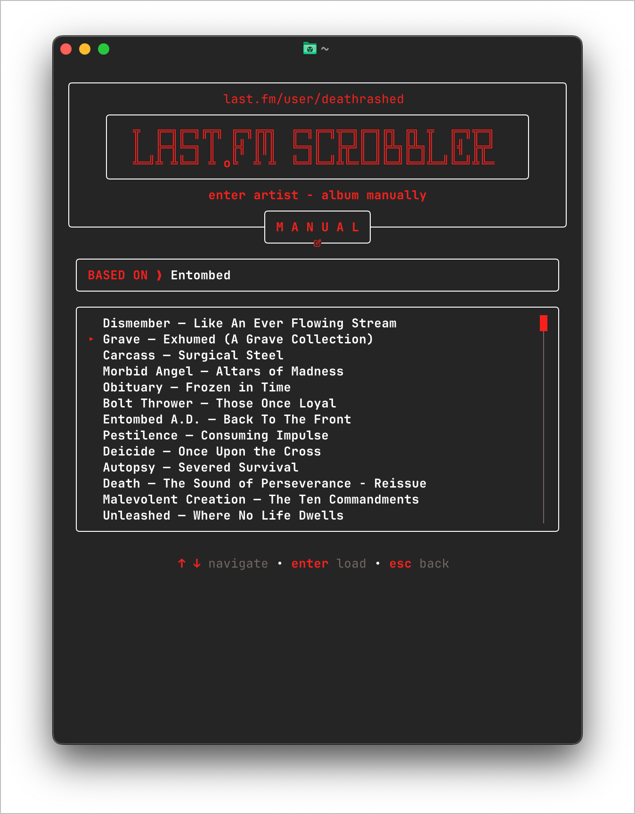

<h1 align="center">𝗟𝗔𝗦𝗧.𝗙𝗠 𝗦𝗖𝗥𝗢𝗕𝗕𝗟𝗘𝗥</h1>

<p align="center">
  
  
  
</p>

<p align="center">
  A fixed-width terminal application for searching, curating, previewing, and
  scrobbling Last.fm album queues.
</p>

<p align="center">
  <a href="#features">Features</a> •
  <a href="#installation--build">Installation</a> •
  <a href="#quick-start">Quick start</a> •
  <a href="#screenshots">Screenshots</a> •
  <a href="#headless-cli">CLI</a> •
  <a href="#credentials">Configuration</a> •
  <a href="#troubleshooting">Troubleshooting</a>
</p>

The visual system is deliberately consistent across every screen:

- 67-column header and content area
- white structural borders
- Last.fm Torch Red (`#f8211c`) active controls
- centered panels and footer hints
- wrapped or clipped long text that cannot break a border
- Nerd Font icons with plain-text fallbacks where practical

The TUI requires at least 67 terminal columns. Compact Header is a user
setting, not an automatic narrow-terminal fallback. Full-header profile URLs
highlight on hover and open on click; compact mode has no profile URL.

##  Features

| Area | What it provides |
| --- | --- |
| **Manual scrobbling** | Search by artist, album, or both, choose tracks, preview the queue, and scrobble with configurable loops and intervals. |
| **Top-album curation** | Filter, sort, clean, select, and queue albums returned by Last.fm's top-albums endpoint. |
| **Import workflows** | Load TXT, CSV, TSV, JSON, M3U/M3U8 playlists, album folders, or artist folders. |
| **Recovery** | Keep history, resume interrupted queues, edit saved sessions, or perform exact re-runs. |
| **Automation** | Use stable JSON-capable CLI commands from Keyboard Maestro, shell scripts, and launch agents. |
| **Terminal UI** | A centered 67-column Bubble Tea interface with Torch Red active controls and mouse support. |

##  Installation & Build

Requirements:

- Go 1.24.2 or newer
- Internet access during the first build so Go can download Bubble Tea modules
- A Nerd Font is recommended for the intended icons (any compatible Nerd Font works)

### Optional Nerd Font setup

The TUI uses Nerd Font glyphs for its icons. Configure your terminal to use an
installed Nerd Font; the core workflows still work if a terminal displays an
icon incorrectly. On macOS with Homebrew, an optional example is:

```bash
brew install --cask font-jetbrains-mono-nerd-font
```

Then select `JetBrainsMono Nerd Font` (or another installed Nerd Font) in your
terminal settings. The application does not install fonts automatically, and
Nerd Fonts are not a mandatory Homebrew dependency.

Install the latest tagged command directly with Go:

```bash
go install github.com/deathrashed/lastfm-scrobbler/cmd/scrobbler@latest
```

```bash
cd /path/to/lastfm-scrobbler
mkdir -p bin
go build -buildvcs=false -o bin/scrobbler ./cmd/scrobbler
./bin/scrobbler
```

A versioned release build can inject source information for update checking:

```bash
go build \
  -ldflags "-X github.com/deathrashed/lastfm-scrobbler/internal/version.Version=v1.0.0 \
            -X github.com/deathrashed/lastfm-scrobbler/internal/version.Commit=$(git rev-parse --short HEAD) \
            -X github.com/deathrashed/lastfm-scrobbler/internal/version.Repository=deathrashed/lastfm-scrobbler" \
  -o bin/scrobbler ./cmd/scrobbler
```

##  Quick start

1. Create the project-local environment file:

   ```bash
   cp .env.example .env
   chmod 600 .env
   ```

2. Add an API key and secret, then choose either a Last.fm password or an
   existing session key:

   ```env
   API_KEY=your-lastfm-api-key
   API_SECRET=your-lastfm-api-secret
   LASTFM_USERNAME=your-username
   LASTFM_SESSION_KEY=your-session-key
   ```

3. Build and launch:

   ```bash
   go build -buildvcs=false -o bin/scrobbler ./cmd/scrobbler
   ./bin/scrobbler
   ```

4. Verify the connection without submitting a scrobble:

   ```bash
   ./bin/scrobbler test
   ```

Source-tree builds can use the project-local `.env`. Installed binaries use
`~/.config/lastfm-scrobbler/.env` by default. Values missing from an
automatically discovered file may be read from `~/.env`. Set
`LASTFM_ENV_FILE=/absolute/path/to/file.env` to make a specific credentials
file authoritative, including before it exists. `.env` is ignored by Git;
`.env.example` is the safe template to commit.

> [!TIP]
> Use `./bin/scrobbler test --json` after setup. It checks Last.fm access and
> authentication readiness without submitting a scrobble.

> [!WARNING]
> Keep `.env`, `~/.env`, and exported credentials files private. Use the
> redacted diagnostics bundle when sharing troubleshooting information.

##  Screenshots

The interface keeps the same Torch Red, fixed-width visual language across
search, selection, settings, recovery, and scrobbling workflows. The
gallery follows the recommended walkthrough order.

> [!NOTE]
> The unified Settings refactor changes the Dashboard, Info, Help, Settings,
> History, and former Advanced views. The corresponding gallery screenshots
> are retained as historical placeholders until fresh captures are added.

<table>
  <tr>
    <td width="33%" valign="top">
      <a href="assets/screenshots/1-dashboard-menu.png"></a>
      <p align="center"><strong>1. Dashboard</strong><br><sub>Search • Select • Scrobble</sub></p>
    </td>
    <td width="33%" valign="top">
      <a href="assets/screenshots/2-info-menu.png"></a>
      <p align="center"><strong>2. Info</strong><br><sub>Modes, automation, data, curation, and imports</sub></p>
    </td>
    <td width="33%" valign="top">
      <a href="assets/screenshots/3-help-menu.png"></a>
      <p align="center"><strong>3. Help</strong><br><sub>Contextual controls at a glance</sub></p>
    </td>
  </tr>
  <tr>
    <td valign="top">
      <p align="center"><strong>4. Settings</strong><br><sub>Account • Scrobbling • History • Tools • Interface • Profiles</sub><br><em>Screenshot refresh pending</em></p>
    </td>
    <td valign="top">
      <a href="assets/screenshots/5-file-menu.png"></a>
      <p align="center"><strong>5. File</strong><br><sub>Lists, playlists, and folders</sub></p>
    </td>
    <td valign="top">
      <a href="assets/screenshots/6-history.png"></a>
      <p align="center"><strong>6. History</strong><br><sub>Recovery, exports, and re-runs</sub></p>
    </td>
  </tr>
  <tr>
    <td valign="top">
      <a href="assets/screenshots/7-discography-search.png"></a>
      <p align="center"><strong>7. Discography search</strong><br><sub>Find an artist's albums</sub></p>
    </td>
    <td valign="top">
      <a href="assets/screenshots/8-discography-filter.png"></a>
      <p align="center"><strong>8. Discography filter</strong><br><sub>Filter, clean, sort, and select</sub></p>
    </td>
    <td valign="top">
      <a href="assets/screenshots/9-discography-progress.png"></a>
      <p align="center"><strong>9. Discography progress</strong><br><sub>Build and scrobble the queue</sub></p>
    </td>
  </tr>
  <tr>
    <td valign="top">
      <a href="assets/screenshots/10-manual-album-selection.png"></a>
      <p align="center"><strong>10. Manual album selection</strong><br><sub>Choose tracks from an album</sub></p>
    </td>
    <td valign="top">
      <a href="assets/screenshots/11-manual-album-preferences.png"></a>
      <p align="center"><strong>11. Manual preferences</strong><br><sub>Adjust loops and queue options</sub></p>
    </td>
    <td valign="top">
      <a href="assets/screenshots/12-manual-progress.png"></a>
      <p align="center"><strong>12. Manual progress</strong><br><sub>Track status and completion</sub></p>
    </td>
  </tr>
  <tr>
    <td valign="top">
      <a href="assets/screenshots/13-manual-complete.png"></a>
      <p align="center"><strong>13. Manual complete</strong><br><sub>Review the finished session</sub></p>
    </td>
    <td valign="top">
      <a href="assets/screenshots/14-manual-similar-albums.png"></a>
      <p align="center"><strong>14. Similar albums</strong><br><sub>Discover related album suggestions</sub></p>
    </td>
    <td valign="top">
      <p align="center"><strong>15. Settings sections</strong><br><sub>Unified configuration and utilities</sub><br><em>Screenshot refresh pending</em></p>
    </td>
  </tr>
</table>

##  Main TUI workflows

### Manual

Search by artist, album, or both, select the correct result when necessary, choose
individual tracks, adjust loops and interval controls, inspect the dry-run
preview, and start scrobbling. Manual result lists show a compact attached
`RESULTS` count rather than a multiselect counter.

### Last.fm top albums

Search an artist, filter and sort the returned albums, hide obvious reissues or
duplicates, select any combination, load their tracks, and build one queue. The
album chooser integrates `SORT`, `FILTER`, and `CLEAN` into the top border with
`RESULTS` and `SELECTED` attached below; long filters expand into a connected
wide input. Long top-album results and track lists include scroll indicators.

### File and folder import

The File page makes every import source visible:

- TXT, CSV, TSV, or JSON album lists
- M3U and M3U8 playlists
- one `Artist/Album` folder
- an artist folder containing album subfolders

The native macOS picker is available with `O`.

### Similar albums

Press `S` from an album result, queue preview, or completed session to retrieve
album suggestions based on similar artists.

### History, recovery, and re-running

Completed and cancelled sessions are recorded locally. History can re-open a
saved queue for editing before it runs again. `Shift+R` performs an exact
re-run without editing. An interrupted active queue is offered for resume at
the next launch.

##  TUI controls

| Context | Controls |
| --- | --- |
| **Global** | Arrow keys or `J/K` navigate, `Enter` confirms, `Esc` goes back, `Q` or `Ctrl+C` quits, and `?` opens help. |
| **Dashboard** | `M` Manual, `D` Discography, `F` File, `H` History, `P` Profiles, `S` Settings, `I` Info. |
| **Track selection** | `Space` toggles a track, `A` selects all, `-/+` changes the current album loop, `Enter` continues, `S` finds similar albums; mouse footer controls also adjust interval and navigation directly. |
| **Settings** | `Tab` moves between section navigation and section content; arrows navigate the active zone; `Enter` saves, opens, or runs the selected item. |

When a text field is focused, printable characters are passed to the field so
usernames, passwords, API keys, paths, and filters can contain normal letters
without triggering navigation shortcuts.

##  Settings interface

Press `S` from the Dashboard to open Settings. The six sections share one fixed
65-cell navigation grid:

```text
╭─────────────────╮ ╭───────────────────────╮ ╭─────────────────╮
│  A C C O U N T  │•│  S C R O B B L I N G  │•│  H I S T O R Y  │
╰─────────────────╯ ╰───────────────────────╯ ╰─────────────────╯
╭─────────────────╮ ╭───────────────────────╮ ╭─────────────────╮
│    T O O L S    │•│   I N T E R F A C E   │•│ P R O F I L E S │
╰─────────────────╯ ╰───────────────────────╯ ╰─────────────────╯
```

The sections are grouped by purpose:

- **Account** — Last.fm username/password, API key/secret, credential source,
  and credential path.
- **Scrobbling** — loop, interval, retries, duplicate guard, and top-album
  cleanup.
- **History** — saved sessions, edit/exact re-runs, export, and delete.
- **Tools** — export directory, update URL, connection test, diagnostics, and
  update checking.
- **Interface** — notifications, Compact Header, and Mouse Support.
- **Profiles** — load, create, save, and delete named profiles.

Settings has two keyboard focus zones. `Tab` or `Shift+Tab` moves from section
content to the six-section grid; arrow keys then choose a section, and `Enter`
or `Tab` returns to its content. Pressing `Up` from the first content row also
returns to the section grid. Mouse users can click a section or setting row
directly.

Settings rows deliberately use a quieter color hierarchy: idle labels are
white, the `❯` accent is Torch Red, and values are muted. The focused row uses
a leading `❯`, turns its label Torch Red, and turns the row arrow/value white;
mouse hover uses the same red-label emphasis without moving keyboard focus.

Navigation cards use a separate state language: idle labels are muted, hover
turns the label Torch Red, and the selected card uses a Torch Red border with
bold white text. Text inputs keep a white structural border and show focus with
a red label, white arrow, and blinking red cursor rather than a red input box.

The Connection Test validates the public API and checks authentication
readiness without sending a scrobble. Diagnostics creates a ZIP with runtime
details, redacted configuration, a history summary, and the tail of the
application log. Passwords, API secrets, session keys, and complete API keys
are excluded.

##  Credentials

Read-only Last.fm operations need an API key. Scrobbling needs an API key, API
secret, and authenticated session.

Either configure an existing session:

```env
API_KEY=...
API_SECRET=...
LASTFM_USERNAME=...
LASTFM_SESSION_KEY=...
```

or let the app obtain a mobile session:

```env
API_KEY=...
API_SECRET=...
LASTFM_USERNAME=...
LASTFM_PASSWORD=...
```

When `LASTFM_SESSION_KEY` is present, the password is not required for normal
scrobbling.

Credential sources:

- `auto`: process environment overrides file values; missing secrets may come
  from macOS Keychain
- `environment`: read credentials only from the real process environment
- `file`: read credentials from the selected environment file
- `keychain`: public values come from environment/file and secrets come from
  macOS Keychain

Saving an unrelated setting preserves file fallback values when an environment
or Keychain override is active. Newly acquired session keys go to Keychain for
`auto` and `keychain`, to the credentials file for `file`, and nowhere
automatically for `environment`.

### Environment file precedence

For normal `auto` mode, values are resolved in this order:

1. Real process environment variables.
2. The project-local `.env` next to the executable.
3. Missing values from `~/.env`.
4. A selected or remembered credentials file.
5. macOS Keychain for missing secret values.
6. Built-in defaults for non-secret settings.

`LASTFM_ENV_FILE=/absolute/path/to/file.env` forces a specific file. **Settings →
Account → Credential Path** can also change and remember the credentials path. `API_SECRET`,
`LASTFM_API_SECRET`, and `LASTFM_SHARED_SECRET` are accepted as aliases.

Credential files are written with owner-only permissions and are ignored by
Git. Never replace `.env.example` with real credentials or commit a credentials
file.

See [docs/CONFIGURATION.md](docs/CONFIGURATION.md) for every variable and its
precedence.

##  Headless CLI

Launching `scrobbler` without a command opens the TUI. Subcommands are stable,
non-interactive entry points suitable for Keyboard Maestro and shell scripts.

```bash
scrobbler manual "Slayer - Hell Awaits"
scrobbler manual --artist Slayer --album "Hell Awaits" --loop 2
scrobbler file ~/Downloads/albums.txt --dry-run
scrobbler discography "Demolition Hammer" --first 3 --dry-run
scrobbler discography "Demolition Hammer" --albums "Epidemic of Violence,Tortured Existence"
scrobbler similar "Demolition Hammer" --limit 20
scrobbler test --json
scrobbler diagnostics --json
scrobbler check-update
```

Common options for `manual`, `file`, and `discography`:

```text
--loop N
--limit N
--interval 2s
--dry-run
--json
```

The CLI returns exit code `0` for success, `1` for an operational failure, and
`2` for invalid command usage. JSON output is intended for automation systems
that need to inspect totals or exported paths.

Detailed command documentation and Keyboard Maestro examples are in
[docs/CLI.md](docs/CLI.md) and [docs/AUTOMATION.md](docs/AUTOMATION.md).

## Shell completion

Generate completion from the binary so it always matches the installed
commands.

### Zsh

```bash
mkdir -p ~/.zfunc
scrobbler completion zsh > ~/.zfunc/_scrobbler
fpath=(~/.zfunc $fpath)
autoload -Uz compinit && compinit
```

### Bash

```bash
scrobbler completion bash > ~/.scrobbler-completion.bash
source ~/.scrobbler-completion.bash
```

### Fish

```bash
mkdir -p ~/.config/fish/completions
scrobbler completion fish > ~/.config/fish/completions/scrobbler.fish
```

## Mouse support

Mouse support is enabled by default and can be disabled in **Settings → Interface** or with
`SCROBBLE_MOUSE=false`.

- click Dashboard modes, File import sources, Settings sections and rows
- use the mouse wheel to navigate results, top-album lists, tracks, Settings,
  History, and Profiles
- click Info tabs, action cards, editable fields, the Help close hint, and contextual footer actions
- hover feedback turns interactive card/list text Torch Red while preserving
  keyboard selection; full-header profile URLs are red at rest and white while
  hovered
- keyboard controls remain available everywhere

With the full header, the Last.fm URL is Torch Red at rest, turns white on
hover, and opens when clicked. Compact Header does not expose a URL target.

Bubble Tea mouse capture can interfere with normal terminal text selection in
some terminals. Disable the setting when native selection is more important.

## Update checking

The checker defaults to the public repository. Configure either:

```env
SCROBBLER_UPDATE_URL=https://api.github.com/repos/deathrashed/lastfm-scrobbler/releases/latest
```

or inject `Repository=deathrashed/lastfm-scrobbler` at build time. A custom endpoint may
return GitHub-style JSON (`tag_name`, `html_url`, `body`) or simple JSON
(`version`, `url`, `notes`). The checker only reports availability; it does not
replace the running binary.

## Exports and diagnostics

Queue/session export formats:

- JSON
- CSV
- TXT
- M3U8

Diagnostics bundles are written to `SCROBBLE_EXPORT_DIR` and are safe to review
before sharing. Application logs rotate after approximately 2 MB.

## Persistent data

By default:

```text
~/.config/lastfm-scrobbler/
```

This contains History, pending-session recovery, profiles, remembered paths,
and `scrobbler.log`. `XDG_DATA_HOME` or `XDG_CONFIG_HOME` is respected.

##  Architecture

```text
Input
  ├─ Bubble Tea TUI
  ├─ Headless CLI / JSON output
  └─ Keyboard Maestro, shell, or launch-agent wrapper
          │
          ▼
Configuration ── project .env ── ~/.env fallback ── Keychain (optional)
          │
          ▼
Last.fm client ── search / album tracks / top albums / similar albums
          │
          ▼
Queue builder ── preview / dry-run / loop / limit / interval
          │
          ▼
Scrobbler ── history / recovery / exports / diagnostics
```

The TUI and CLI share the same configuration, Last.fm client, queue-building,
history, export, and diagnostics packages. This keeps interactive and
automation workflows behaviorally aligned.

##  Troubleshooting

<details>
  <summary><strong>Credentials are saved to the wrong file</strong></summary>

The default file is the project-local `.env` beside the executable. Check the
current value in **Settings → Account → Credential Path**, or force a path explicitly:

```bash
LASTFM_ENV_FILE=/absolute/path/to/file.env scrobbler test
```

Older remembered paths are used only after the project-local file has been
checked. `.env` is ignored by Git and should have owner-only permissions.

</details>

<details>
  <summary><strong>Connection test reports missing authentication</strong></summary>

Read-only lookups need `API_KEY`. Scrobbling also needs `API_SECRET` plus either
`LASTFM_SESSION_KEY` or `LASTFM_USERNAME` and `LASTFM_PASSWORD`. Run
`scrobbler test --json` to distinguish missing configuration from an API or
authentication failure.

</details>

<details>
  <summary><strong>Icons or mouse behavior look wrong</strong></summary>

Use a Nerd Font for the intended glyphs. Disable mouse capture with
`SCROBBLE_MOUSE=false` when terminal text selection is more important than
mouse navigation.

</details>

<details>
  <summary><strong>Automation receives human-readable output</strong></summary>

Use `--json` on supported commands and keep credentials outside command-line
arguments. The diagnostics command creates a redacted ZIP; inspect it before
sharing.

</details>

##  Limitations

- The application requires network access to resolve Last.fm albums and submit
  scrobbles.
- It does not download music or repair Last.fm metadata; it works with album
  and track data returned by Last.fm.
- Dry runs resolve and display the queue but do not validate a successful
  scrobble.
- API limits, unavailable albums, renamed releases, and Last.fm authentication
  failures remain external service conditions.

##  Testing

```bash
go test ./...
go vet ./...
```

The project includes tests for Last.fm response parsing, configuration,
imports, exports, history/recovery, queue construction, fixed-width layouts,
connection reports, diagnostics redaction, update parsing, and editable
re-runs.

## Project documentation

- [CLI reference](docs/CLI.md)
- [Automation and Keyboard Maestro](docs/AUTOMATION.md)
- [Configuration and credentials](docs/CONFIGURATION.md)
- [TUI controls and workflows](docs/TUI.md)
- [Release checklist](docs/RELEASING.md)
- [Last.fm colour reference](docs/Last.fm-colors.html)

## License

This project uses the **Do What The Fuck You Want To Public License, Version
2**, supplied in [LICENSE](LICENSE).
